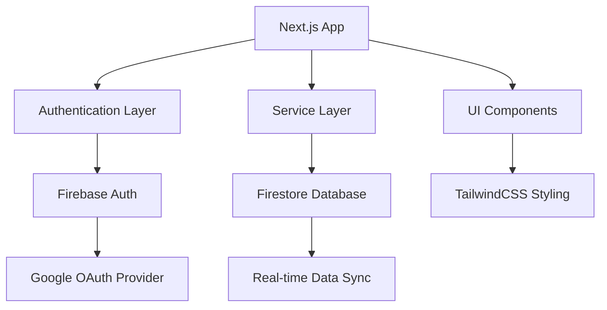

# Design Document

## Overview

This design outlines a Next.js application with TailwindCSS and Firebase integration. The application will feature a modern, component-based architecture with Firebase Authentication for Google sign-in and Firestore for data persistence. The design emphasizes clean separation of concerns, TypeScript safety, and responsive design principles.

## Architecture

### High-Level Architecture



### Technology Stack

- **Frontend Framework:** Next.js 14+ with App Router
- **Styling:** TailwindCSS 3.x
- **Authentication:** Firebase Authentication with Google Provider
- **Database:** Firebase Firestore
- **Language:** TypeScript
- **State Management:** React Context API for auth state

## Components and Interfaces

### Core Components Structure

```
src/
├── components/
│   ├── ui/           # Reusable UI components
│   ├── auth/         # Authentication-related components
│   └── layout/       # Layout components
├── services/
│   ├── firebase/     # Firebase configuration and services
│   └── auth/         # Authentication service layer
├── contexts/         # React contexts
├── types/           # TypeScript type definitions
├── hooks/           # Custom React hooks
└── app/             # Next.js app directory
```

### Key Components

#### Authentication Components
- `LoginButton`: Google sign-in button with Firebase integration
- `UserProfile`: Display authenticated user information
- `AuthGuard`: Protected route wrapper component
- `SignOutButton`: Sign out functionality

#### UI Components
- `Button`: Reusable button component with TailwindCSS variants
- `Card`: Container component for content sections
- `LoadingSpinner`: Loading state indicator
- `ErrorMessage`: Error display component

#### Layout Components
- `Header`: Navigation header with auth status
- `Layout`: Main application layout wrapper
- `Sidebar`: Optional navigation sidebar

### Service Interfaces

#### Firebase Configuration
```typescript
interface FirebaseConfig {
  apiKey: string;
  authDomain: string;
  projectId: string;
  storageBucket: string;
  messagingSenderId: string;
  appId: string;
}
```

#### Authentication Service
```typescript
interface AuthService {
  signInWithGoogle(): Promise<User | null>;
  signOut(): Promise<void>;
  getCurrentUser(): User | null;
  onAuthStateChanged(callback: (user: User | null) => void): () => void;
}
```

#### Firestore Service
```typescript
interface FirestoreService {
  createDocument(collection: string, data: any): Promise<string>;
  getDocument(collection: string, id: string): Promise<any>;
  updateDocument(collection: string, id: string, data: any): Promise<void>;
  deleteDocument(collection: string, id: string): Promise<void>;
  subscribeToCollection(collection: string, callback: (data: any[]) => void): () => void;
}
```

## Data Models

### User Model
```typescript
interface User {
  uid: string;
  email: string;
  displayName: string;
  photoURL?: string;
  createdAt: Date;
  lastLoginAt: Date;
}
```

### Authentication Context
```typescript
interface AuthContextType {
  user: User | null;
  loading: boolean;
  error: string | null;
  signIn: () => Promise<void>;
  signOut: () => Promise<void>;
}
```

## Error Handling

### Error Types
- **Authentication Errors:** Failed login, network issues, invalid credentials
- **Firestore Errors:** Permission denied, network failures, quota exceeded
- **Application Errors:** Component rendering errors, invalid state

### Error Handling Strategy
1. **Service Level:** Catch and transform Firebase errors into user-friendly messages
2. **Component Level:** Display error states with retry mechanisms
3. **Global Level:** Error boundary components for unhandled errors
4. **Logging:** Console logging for development, structured logging for production

### Error Display Components
- Toast notifications for temporary errors
- Inline error messages for form validation
- Error pages for critical failures
- Loading states during async operations

## Testing Strategy

### Unit Testing
- Component rendering and behavior testing with React Testing Library
- Service layer testing with mocked Firebase functions
- Custom hook testing for authentication state management
- Utility function testing for data transformations

### Integration Testing
- Authentication flow testing with Firebase emulator
- Firestore operations testing with test data
- Component integration testing with context providers
- End-to-end user journey testing

### Testing Tools
- **Jest:** Unit test runner and assertion library
- **React Testing Library:** Component testing utilities
- **Firebase Emulator Suite:** Local Firebase services for testing
- **MSW (Mock Service Worker):** API mocking for integration tests

## Configuration and Environment

### Environment Variables
```
NEXT_PUBLIC_FIREBASE_API_KEY=
NEXT_PUBLIC_FIREBASE_AUTH_DOMAIN=
NEXT_PUBLIC_FIREBASE_PROJECT_ID=
NEXT_PUBLIC_FIREBASE_STORAGE_BUCKET=
NEXT_PUBLIC_FIREBASE_MESSAGING_SENDER_ID=
NEXT_PUBLIC_FIREBASE_APP_ID=
```

### TailwindCSS Configuration
- Custom color palette for brand consistency
- Responsive breakpoints for mobile-first design
- Custom component classes for common UI patterns
- Dark mode support configuration

### Next.js Configuration
- TypeScript strict mode enabled
- ESLint and Prettier integration
- Image optimization configuration
- Environment-specific build settings

## Security Considerations

### Firebase Security Rules
- Authenticated user access controls
- Document-level permissions
- Rate limiting for API calls
- Data validation rules

### Client-Side Security
- Environment variable protection
- XSS prevention through proper data sanitization
- CSRF protection through Firebase SDK
- Secure authentication token handling

## Performance Optimization

### Code Splitting
- Dynamic imports for Firebase services
- Lazy loading of non-critical components
- Route-based code splitting with Next.js

### Caching Strategy
- Firebase SDK caching for offline support
- Next.js static generation where applicable
- Browser caching for static assets
- Service worker for offline functionality

### Bundle Optimization
- Tree shaking for unused Firebase features
- TailwindCSS purging for production builds
- Image optimization with Next.js Image component
- Compression and minification for production