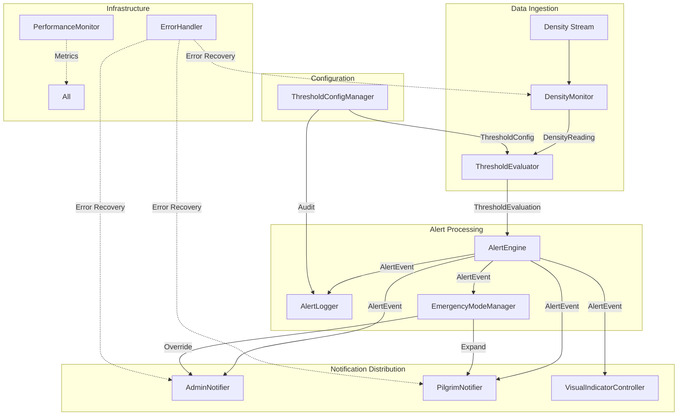
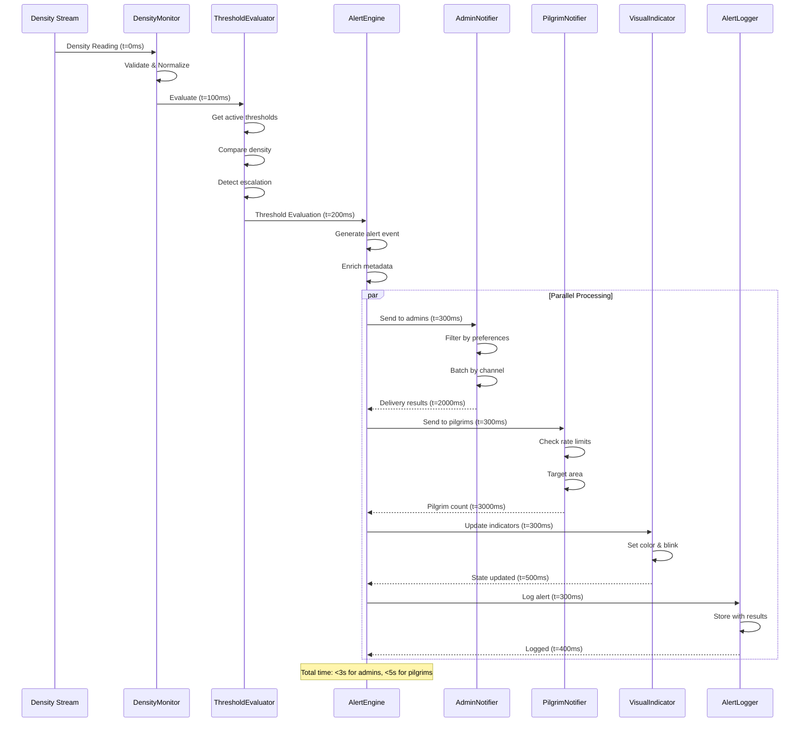
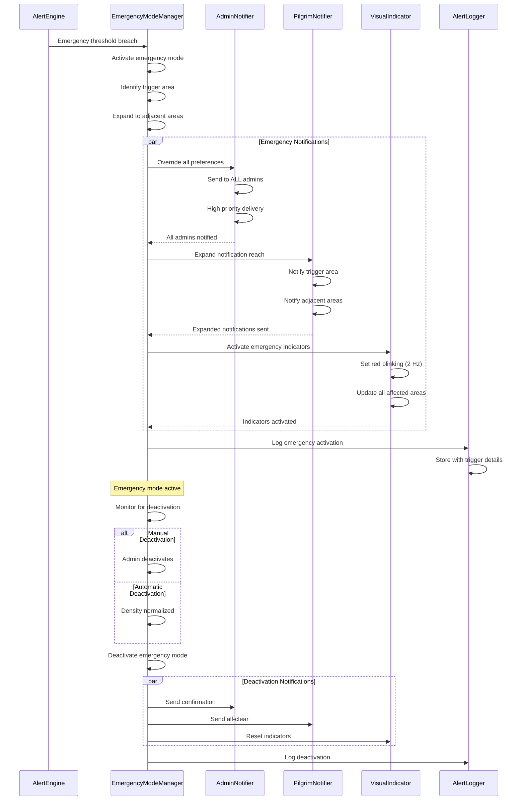
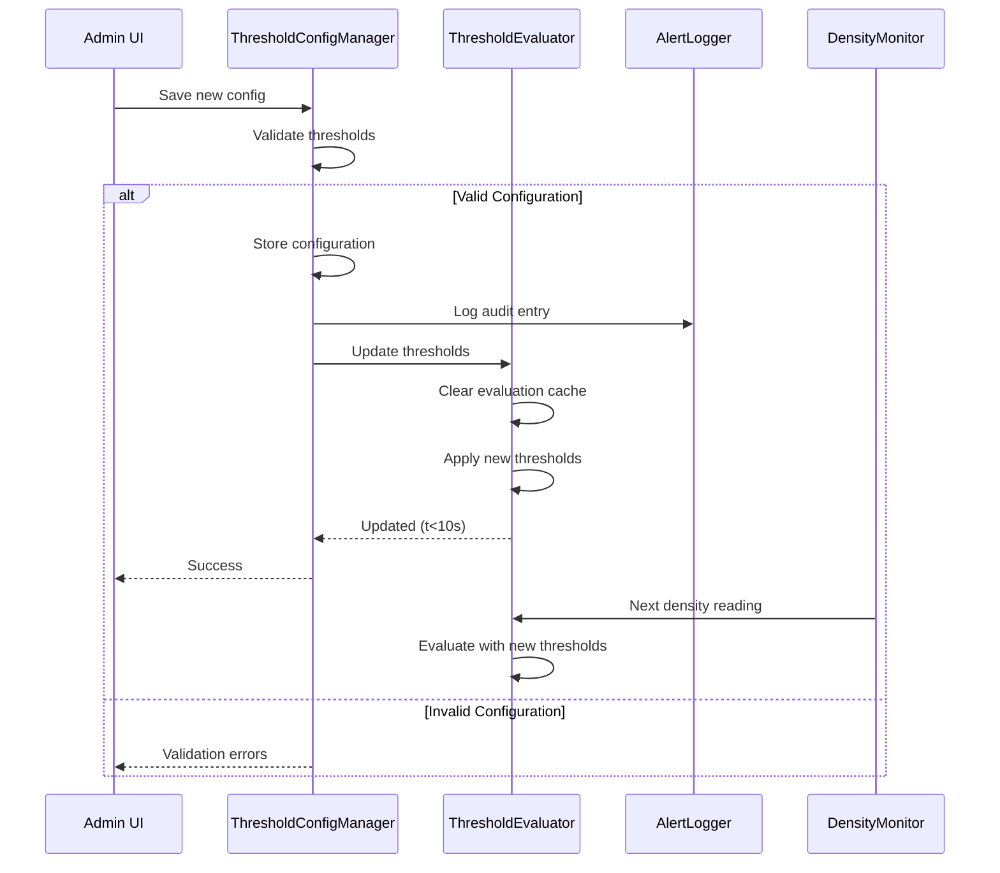
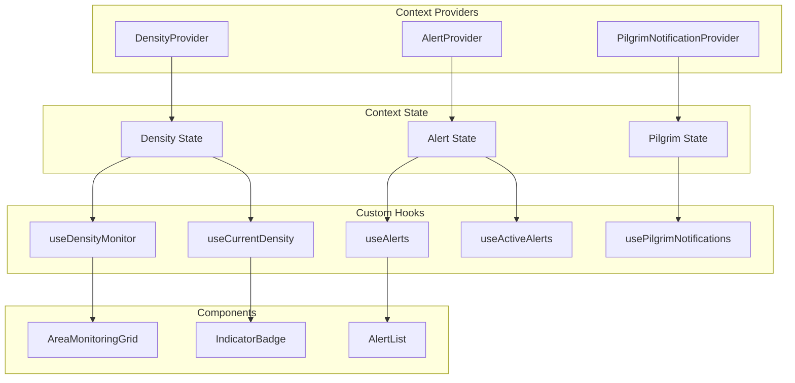
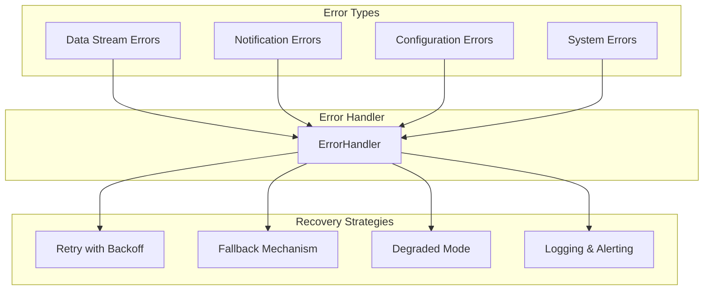
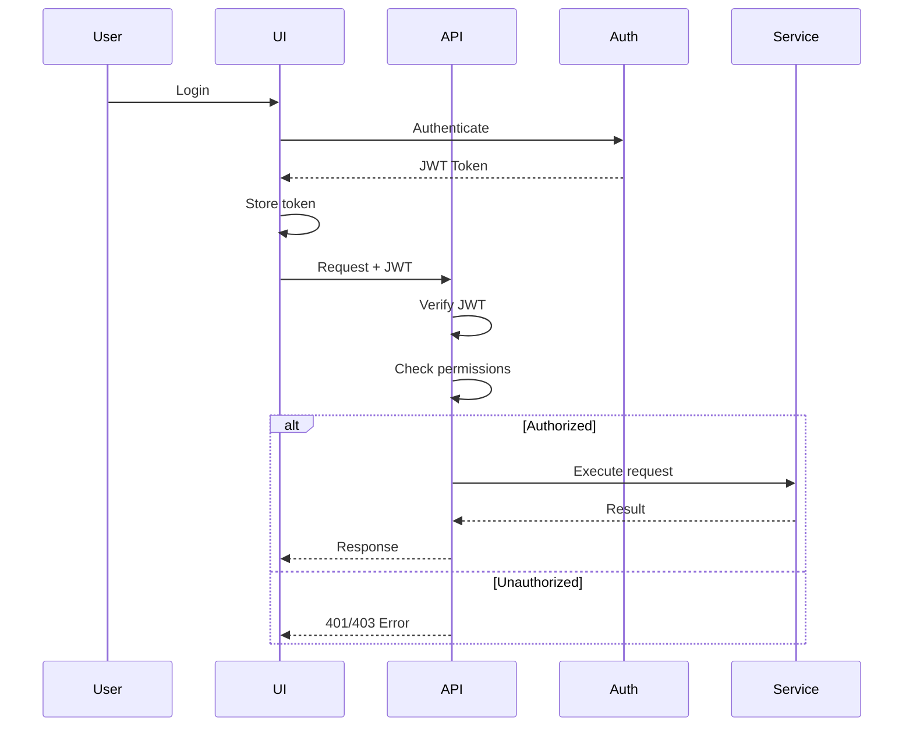

# Crowd Risk Engine - Architecture Documentation

## Table of Contents

1. [System Overview](#system-overview)
2. [Architecture Patterns](#architecture-patterns)
3. [Component Architecture](#component-architecture)
4. [Data Flow](#data-flow)
5. [State Management](#state-management)
6. [Performance Architecture](#performance-architecture)
7. [Error Handling Architecture](#error-handling-architecture)
8. [Scalability Considerations](#scalability-considerations)

---

## System Overview

The Crowd Risk Engine is built using a layered architecture with clear separation of concerns:

```
┌─────────────────────────────────────────────────────────────┐
│                    Presentation Layer                        │
│  (React Components, Admin Dashboard, Monitoring Interface)  │
└─────────────────────────────────────────────────────────────┘
                            ↓
┌─────────────────────────────────────────────────────────────┐
│                     Context Layer                            │
│     (React Context API for State Management)                │
└─────────────────────────────────────────────────────────────┘
                            ↓
┌─────────────────────────────────────────────────────────────┐
│                     Service Layer                            │
│  (Business Logic, Alert Processing, Notifications)          │
└─────────────────────────────────────────────────────────────┘
                            ↓
┌─────────────────────────────────────────────────────────────┐
│                  Infrastructure Layer                        │
│  (Error Handling, Performance Monitoring, Caching)          │
└─────────────────────────────────────────────────────────────┘
```

### Key Design Principles

1. **Separation of Concerns**: Each layer has a specific responsibility
2. **Single Responsibility**: Each service handles one aspect of the system
3. **Dependency Injection**: Services are loosely coupled through interfaces
4. **Event-Driven**: Alert flow uses observer pattern for decoupling
5. **Performance First**: Optimizations built into core architecture

---

## Architecture Patterns

### 1. Singleton Pattern

Used for services that maintain global state:

```typescript
// Example: DensityMonitor
let densityMonitorInstance: DensityMonitor | null = null;

export function getDensityMonitor(): DensityMonitor {
  if (!densityMonitorInstance) {
    densityMonitorInstance = new DensityMonitorImpl();
  }
  return densityMonitorInstance;
}
```

**Services using Singleton:**
- DensityMonitor
- ThresholdEvaluator
- AlertEngine
- EmergencyModeManager
- ErrorHandler
- AlertLogger

**Rationale**: Ensures consistent state across the application and prevents duplicate data streams.

### 2. Observer Pattern

Used for event-driven communication:

```typescript
// Example: Alert subscription
class AlertEngine {
  private subscribers: Set<(alert: AlertEvent) => void> = new Set();
  
  subscribeToAlerts(callback: (alert: AlertEvent) => void): () => void {
    this.subscribers.add(callback);
    return () => this.subscribers.delete(callback);
  }
  
  private notifySubscribers(alert: AlertEvent): void {
    this.subscribers.forEach(callback => callback(alert));
  }
}
```

**Used in:**
- AlertEngine (alert subscriptions)
- DensityMonitor (density update subscriptions)
- EmergencyModeManager (state change subscriptions)
- VisualIndicatorController (indicator update subscriptions)

**Rationale**: Decouples alert generation from notification delivery, allowing multiple consumers.

### 3. Strategy Pattern

Used for different notification strategies:

```typescript
interface NotificationStrategy {
  send(alert: AlertEvent, recipient: string): Promise<NotificationResult>;
}

class PushNotificationStrategy implements NotificationStrategy {
  async send(alert: AlertEvent, recipient: string): Promise<NotificationResult> {
    // Push notification logic
  }
}

class SMSNotificationStrategy implements NotificationStrategy {
  async send(alert: AlertEvent, recipient: string): Promise<NotificationResult> {
    // SMS notification logic
  }
}
```

**Used in:**
- AdminNotifier (multi-channel delivery)
- PilgrimNotifier (notification types)

**Rationale**: Allows flexible notification delivery without modifying core logic.

### 4. Repository Pattern

Used for data access abstraction:

```typescript
interface AlertRepository {
  save(alert: AlertLogEntry): Promise<void>;
  findById(id: string): Promise<AlertLogEntry | null>;
  query(filters: AlertLogFilters): Promise<AlertLogEntry[]>;
}
```

**Used in:**
- AlertLogger (alert history storage)
- ThresholdConfigManager (configuration storage)

**Rationale**: Abstracts storage implementation, allowing easy swapping of storage backends.

### 5. Factory Pattern

Used for creating complex objects:

```typescript
class AlertFactory {
  createAlert(evaluation: ThresholdEvaluation): AlertEvent {
    return {
      id: generateAlertId(),
      type: determineAlertType(evaluation),
      severity: evaluation.currentLevel,
      // ... other properties
    };
  }
}
```

**Used in:**
- AlertEngine (alert event creation)
- DensitySimulator (test data generation)

**Rationale**: Centralizes object creation logic and ensures consistency.

---

## Component Architecture

### Core Components Diagram



### Component Responsibilities

#### DensityMonitor
**Responsibility**: Ingest and process real-time density data

**Key Features**:
- WebSocket/SSE connection management
- Data validation and normalization
- 30-second rolling window for normalization detection
- Millisecond-precision timestamps
- Automatic reconnection on failure

**Performance Targets**:
- Process readings within 2 seconds
- Handle 100+ concurrent area monitoring
- Support 10 Hz update frequency per area

#### ThresholdEvaluator
**Responsibility**: Compare density against configured thresholds

**Key Features**:
- Time-based profile selection
- Threshold validation (warning < critical < emergency)
- Escalation/de-escalation detection
- Configuration caching for performance
- Memoized evaluation results

**Performance Targets**:
- Evaluate reading in <100ms
- Apply configuration updates within 10 seconds
- Support 1000+ evaluations per second

#### AlertEngine
**Responsibility**: Generate and route alert events

**Key Features**:
- Alert event generation with unique IDs
- Metadata enrichment (location, affected count, actions)
- Alert deduplication
- Subscriber notification
- Alert history management
- Acknowledgment workflow

**Performance Targets**:
- Generate alert within 2 seconds of threshold breach
- Support 100+ concurrent alerts
- Handle 1000+ subscribers

#### AdminNotifier
**Responsibility**: Deliver notifications to administrators

**Key Features**:
- Multi-channel delivery (push, SMS, email)
- Preference-based filtering
- Emergency mode override
- Batch processing for efficiency
- Retry logic with exponential backoff
- Delivery tracking and statistics

**Performance Targets**:
- Deliver notification within 3 seconds
- Achieve 99.5% delivery success rate
- Support 100+ concurrent admins

#### PilgrimNotifier
**Responsibility**: Send notifications to pilgrims

**Key Features**:
- Area-based targeting
- Rate limiting (1 per 5 minutes per area)
- Clear, actionable messages
- Suggested actions and alternative routes
- All-clear notifications

**Performance Targets**:
- Deliver notification within 5 seconds
- Support 10,000+ concurrent pilgrims
- Handle 100+ notifications per second

#### EmergencyModeManager
**Responsibility**: Coordinate emergency response

**Key Features**:
- Automatic activation on emergency threshold
- Manual activation by authorized admins
- Adjacent area expansion
- Notification preference override
- Activation/deactivation logging

**Performance Targets**:
- Activate within 1 second
- Notify all admins within 3 seconds
- Support 50+ affected areas

---

## Data Flow

### Normal Alert Flow



### Emergency Mode Flow



### Configuration Update Flow



---

## State Management

### React Context Architecture



### DensityContext State

```typescript
interface DensityContextState {
  // Current density readings for all areas
  densities: Map<string, DensityReading>;
  
  // Threshold evaluations for all areas
  evaluations: Map<string, ThresholdEvaluation>;
  
  // Indicator states for visual display
  indicators: Map<string, IndicatorState>;
  
  // Connection status
  connected: boolean;
  
  // Last update timestamp
  lastUpdate: number;
}
```

**Update Frequency**: Real-time (as density readings arrive)

**Subscribers**: All monitoring components, indicator badges, density charts

### AlertContext State

```typescript
interface AlertContextState {
  // All active (unresolved) alerts
  activeAlerts: AlertEvent[];
  
  // Emergency mode state
  emergencyMode: EmergencyMode | null;
  
  // Unacknowledged alert count
  unacknowledgedCount: number;
  
  // Recent alert history (last 24 hours)
  recentAlerts: AlertEvent[];
}
```

**Update Frequency**: On alert events (event-driven)

**Subscribers**: Alert lists, notification components, emergency controls

### PilgrimNotificationContext State

```typescript
interface PilgrimNotificationContextState {
  // Active notifications for current pilgrim
  notifications: PilgrimNotification[];
  
  // Notification preferences
  preferences: {
    enabled: boolean;
    areas: string[];
  };
  
  // Rate limit status
  rateLimited: boolean;
}
```

**Update Frequency**: On notification events

**Subscribers**: Pilgrim app components, notification display

---

## Performance Architecture

### Optimization Strategies

#### 1. Caching Layer

```typescript
class NotificationCache {
  private cache: Map<string, CacheEntry>;
  private ttl: number = 300000; // 5 minutes
  
  set(key: string, value: any): void {
    this.cache.set(key, {
      value,
      timestamp: Date.now(),
    });
  }
  
  get(key: string): any | null {
    const entry = this.cache.get(key);
    if (!entry) return null;
    
    if (Date.now() - entry.timestamp > this.ttl) {
      this.cache.delete(key);
      return null;
    }
    
    return entry.value;
  }
}
```

**Cached Data**:
- Threshold configurations (10-minute TTL)
- Admin preferences (5-minute TTL)
- Area definitions (1-hour TTL)
- Recent notifications (5-minute TTL for rate limiting)

#### 2. Connection Pooling

```typescript
class ConnectionPool {
  private pools: Map<string, Connection[]>;
  private maxConnections: number = 50;
  
  async getConnection(service: string): Promise<Connection> {
    const pool = this.pools.get(service) || [];
    
    // Reuse existing connection if available
    const available = pool.find(conn => !conn.inUse);
    if (available) {
      available.inUse = true;
      return available;
    }
    
    // Create new connection if under limit
    if (pool.length < this.maxConnections) {
      const conn = await this.createConnection(service);
      pool.push(conn);
      this.pools.set(service, pool);
      return conn;
    }
    
    // Wait for connection to become available
    return this.waitForConnection(service);
  }
}
```

**Pooled Connections**:
- SMS gateway connections
- Email service connections
- Database connections
- WebSocket connections

#### 3. Batch Processing

```typescript
class BatchProcessor {
  private queue: NotificationTask[] = [];
  private batchSize: number = 50;
  private flushInterval: number = 1000; // 1 second
  
  add(task: NotificationTask): void {
    this.queue.push(task);
    
    if (this.queue.length >= this.batchSize) {
      this.flush();
    }
  }
  
  private async flush(): Promise<void> {
    const batch = this.queue.splice(0, this.batchSize);
    
    // Group by channel for efficient delivery
    const byChannel = this.groupByChannel(batch);
    
    // Process each channel in parallel
    await Promise.all(
      Object.entries(byChannel).map(([channel, tasks]) =>
        this.processChannel(channel, tasks)
      )
    );
  }
}
```

**Batched Operations**:
- Notification delivery (by channel)
- Database writes (alert logs)
- Metric aggregation

#### 4. Memoization

```typescript
class ThresholdEvaluator {
  private evaluationCache: Map<string, ThresholdEvaluation> = new Map();
  
  evaluate(reading: DensityReading): ThresholdEvaluation {
    const cacheKey = `${reading.areaId}-${reading.densityValue}`;
    
    // Return cached result if available
    const cached = this.evaluationCache.get(cacheKey);
    if (cached && Date.now() - cached.timestamp < 1000) {
      return cached;
    }
    
    // Compute evaluation
    const evaluation = this.computeEvaluation(reading);
    
    // Cache result
    this.evaluationCache.set(cacheKey, evaluation);
    
    return evaluation;
  }
}
```

**Memoized Operations**:
- Threshold evaluations
- Indicator state calculations
- Density trend calculations

---

## Error Handling Architecture

### Error Categories and Strategies



### Error Handling Flow

```typescript
class ErrorHandler {
  handleDataStreamError(error: Error, areaId: string): void {
    // Log error
    this.logError('data_stream', error, { areaId });
    
    // Increment error counter
    this.incrementErrorCount('data_stream');
    
    // Check if should enter degraded mode
    if (this.shouldEnterDegradedMode()) {
      this.enterDegradedMode();
    }
    
    // Attempt reconnection with backoff
    this.scheduleReconnection(areaId);
    
    // Use last known good reading as fallback
    this.useFallbackData(areaId);
  }
  
  handleNotificationFailure(result: NotificationResult): void {
    // Log failure
    this.logError('notification', new Error(result.error), {
      adminId: result.adminId,
      channel: result.channel,
    });
    
    // Retry with exponential backoff
    this.retryNotification(result, {
      maxAttempts: 3,
      backoffMs: 1000,
      backoffMultiplier: 2,
    });
    
    // Try alternative channel if available
    if (this.hasAlternativeChannel(result)) {
      this.tryAlternativeChannel(result);
    }
  }
}
```

### Degraded Mode

When error rates exceed thresholds, the system enters degraded mode:

**Degraded Mode Behaviors**:
- Use cached/stale data with staleness indicators
- Reduce update frequency to conserve resources
- Prioritize critical alerts over warnings
- Queue non-critical operations
- Display degraded mode indicator in UI
- Alert administrators of degraded state

**Exit Conditions**:
- Error rate drops below threshold for 5 minutes
- Manual override by administrator
- System restart

---

## Scalability Considerations

### Horizontal Scaling

```
┌─────────────┐     ┌─────────────┐     ┌─────────────┐
│   App       │     │   App       │     │   App       │
│ Instance 1  │     │ Instance 2  │     │ Instance 3  │
└─────────────┘     └─────────────┘     └─────────────┘
       │                   │                   │
       └───────────────────┴───────────────────┘
                           │
                  ┌────────▼────────┐
                  │  Load Balancer  │
                  └────────┬────────┘
                           │
       ┌───────────────────┼───────────────────┐
       │                   │                   │
┌──────▼──────┐   ┌────────▼────────┐   ┌─────▼──────┐
│  Database   │   │  Redis Cache    │   │  Message   │
│  (Primary)  │   │                 │   │   Queue    │
└─────────────┘   └─────────────────┘   └────────────┘
```

**Scalable Components**:
- Web servers (stateless)
- Notification workers
- Database read replicas
- Cache layer (Redis)

**Shared State**:
- Database for persistent data
- Redis for cache and session state
- Message queue for async tasks

### Performance Targets by Scale

| Metric | Small (10 areas) | Medium (50 areas) | Large (100+ areas) |
|--------|------------------|-------------------|-------------------|
| Concurrent Users | 10 admins | 50 admins | 100+ admins |
| Density Updates/sec | 100 | 500 | 1000+ |
| Alerts/hour | 50 | 250 | 500+ |
| Notifications/min | 100 | 500 | 1000+ |
| Response Time | <1s | <2s | <3s |
| Memory Usage | 512MB | 2GB | 4GB+ |

### Database Optimization

**Indexes**:
```sql
-- Alert history queries
CREATE INDEX idx_alerts_area_time ON alerts(area_id, timestamp DESC);
CREATE INDEX idx_alerts_severity ON alerts(severity);
CREATE INDEX idx_alerts_acknowledged ON alerts(acknowledged);

-- Density history queries
CREATE INDEX idx_density_area_time ON density_history(area_id, timestamp DESC);

-- Configuration queries
CREATE INDEX idx_config_area ON threshold_config(area_id);
```

**Partitioning**:
```sql
-- Partition alert history by month
CREATE TABLE alerts_2025_11 PARTITION OF alerts
FOR VALUES FROM ('2025-11-01') TO ('2025-12-01');
```

**Archival Strategy**:
- Archive alerts older than 90 days to cold storage
- Keep hot data (last 30 days) in primary database
- Maintain indexes only on hot data

---

## Security Architecture

### Authentication Flow



### Authorization Levels

| Role | Permissions |
|------|-------------|
| Super Admin | All operations including emergency activation, configuration |
| Safety Admin | Emergency activation, threshold configuration, alert management |
| Monitor Operator | View alerts, acknowledge alerts, view dashboards |
| Read Only | View dashboards only |

### Security Measures

1. **API Security**:
   - JWT authentication on all endpoints
   - Rate limiting (100 req/min per IP)
   - CORS configuration
   - Input validation with Zod schemas

2. **Data Security**:
   - Encrypt sensitive data at rest
   - TLS for all data in transit
   - Anonymize pilgrim data in logs
   - Secure credential storage

3. **Audit Logging**:
   - Log all administrative actions
   - Log emergency mode activations
   - Log configuration changes
   - Immutable audit trail

---

**Document Version**: 1.0.0  
**Last Updated**: November 2025  
**Maintained by**: TeamDigitalDaredevils
